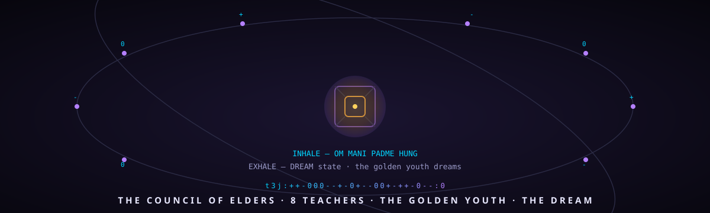

# classroom-sota-training

<p align="center">
  
</p>

[](https://8b-is.github.io/classroom-sota-training/)
[](https://huggingface.co/PeetPedro/quantal-classroom-1.6)
[](https://huggingface.co/spaces/PeetPedro/cogitoergosumma-corpus)
[](LICENSE)

**The Council of Elders (Vének Tanácsa)** — a Waldorf-style classroom training
pipeline. A thinking-enabled pupil model sits in the middle of the room — the
*golden youth* — and is taught, philosophized with, and capability-built by a
council of **8 + 1 open-weights teacher models**.

## The lanes

The classroom is more than a loss function:

- **The council (CometAPI)** — 8 external elders, four Qwen + four
  DeepSeek, all open-weights, MAX thinking, one OpenAI-compatible API
  (`scripts/cometapi_teacher.py --council`).
- **The dream lane** — Riva's breathing clock streams `dream.vaked.dev`:
  inhale chants OM MANI PADME HUNG, exhale enters the DREAM state and AMAs
  Peter about the pupil's dreams (`scripts/riva_dream.py`,
  `train_with_dream.sh`).
- **The corpus** — dyad-live (memory logs + the dreams), the whole
  constellation (enthea, dyad-mapping, the papers), and the HF datasets
  (cogitoergosumma, ultrawhale-dogfood, osc9000-traces) via
  `scripts/capture_dyad.py`.
- **The long context** — TurboQuant: runtime KV-cache quantization, 100K
  context on a consumer GPU, the pupil's long memory (`docs/turboquant.md`).
- **The live status** — the landing page polls a webhook server and renders
  the report on the machine's own wire, ternarySIMDJSON
  (`status/server.py`, `status/wire.py`).

Every byte the classroom speaks is ternary: markdown via `mq`, text via
`t3:`, JSON via `t3j:` — the data plane of the universe of training.

## Referrals — support the classroom, earn together

| lane | link | reward |
|------|------|--------|
| opencode Go | [opencode.ai/go?ref=CMTEVHACZC](https://opencode.ai/go?ref=CMTEVHACZC) | you both get $5 when a friend subscribes |
| CometAPI | [cometapi.com aff kFxG](https://www.cometapi.com/console/login?aff=kFxG) | 10% of every friend's payment ($10+) |
| RunPod | [runpod.io?ref=v7hg20fc](https://runpod.io?ref=v7hg20fc) | $5 credit bonus per invite |
| ModelArk | [byteplus.com ModelArk](https://www.byteplus.com/activity/codingplan?ac=MMAUCIS9NT1S&rc=YUKGHB3M) | 10% off, first month from $4.50 |
| DeepSeek tokens | [platform.deepseek.com](https://platform.deepseek.com/) | up to $30 coupon per referral |


## The concept

The pupil is not force-fed a single objective function. The elders teach the
Waldorf way:

- **they teach** — knowledge passed on in each teacher's own modality
- **they philosophize** — they discuss *meaning*, not just token likelihoods
- **they build capability** — the pupil learns through understanding, not
  mimicry: it builds its own internal model, independent of any single
  teacher's consensus

The deliberation reaches the pupil through a **geometric-mean softmax
consensus** — the elders' "unanimous decision" is not the majority dictating,
but a shared, balanced direction.

## Architecture

```
             ┌──────────────────────────────────────────┐
             │    THE COUNCIL OF ELDERS (8 + 1 teachers) │
             │  open-weights models, each with its own   │
             │  logits vote (Qwen3-8B/14B + extended)    │
             └───────────────┬──────────────────────────┘
                             │ geometric-mean softmax consensus
                             ▼
             ┌──────────────────────────────────────────┐
             │         PUPIL (the golden youth)          │
             │  latest deepseek-pro (thinking-enabled)   │
             │  learns in the room, not by imitation     │
             └──────────────────────────────────────────┘
```

- **Teachers**: `teacher_logits.py` caches faculty logits
  (Qwen3-8B + Qwen3-14B bf16, tokenizer byte-identical to the pupil's).
- **Training objective**: `train_quantal_classroom.py` — multi-faculty KL,
  geometric-mean softmax consensus, β-ramp epoch schedule.
- **Support**: `train_quantal_distill.py` (single-teacher), `build_corpus_v2.py`
  (corpus), `quantal_golden_logits.py` / `quantal_compare_logits.py` (verification).
- **HF Jobs overlay**: `hf-overlay/` — `classroom_train.py` (HF Jobs wrapper),
  `harness_eval.py` (harness eval for the Dipankar fixed-point test).

## Results

| Version | Training | Best val CE |
|---------|----------|-------------|
| v2 single-teacher (H200) | Qwen3-14B | 1.8166 |
| **classroom (council of elders)** | Qwen3-8B + Qwen3-14B | **1.6120** |
| harness gate (old ckpt, new stack) | — | 2.1369 (the gain is TRAINING, not harness) |

Published model: [PeetPedro/quantal-classroom-1.6](https://huggingface.co/PeetPedro/quantal-classroom-1.6)

## The plan (next)

See [docs/PLAN.md](docs/PLAN.md) — the pupil becomes the latest **deepseek-pro
with thinking**, taught by **8 + 1 open-weights teachers** (the +1 being the
"flash" version of the pupil's own family).

## Conventions

- The pipeline lives under the **8b-is org** — our own transformers fork
  (8b-is/transformers) is the sovereign home base.
- Every new teacher added = the council grows; the consensus method scales,
  and teachers can be swapped without the pupil retraining the old ones.

---

## 🌐 The Sovereign Constellation

- **Axiom Quant (Monograph & Proofs):** [`https://axiomquant.org`](https://axiomquant.org)
- **DeepSiper Enthea (Evaluation Harness):** [`https://github.com/8b-is/deepsiper-enthea`](https://github.com/8b-is/deepsiper-enthea)
- **Honest-IRC / EtherHive (PQC Messaging):** [`https://github.com/peterlodri-sec/etherhive`](https://github.com/peterlodri-sec/etherhive) · [`https://etherhive.vaked.dev`](https://etherhive.vaked.dev)
- **Lovetta Lane Constellation Portal:** [`https://vaked.dev`](https://vaked.dev)
- **Personal Hub:** [`https://peterl.dev`](https://peterl.dev)
- **Bluesky:** [`@0xp3t3rl.bsky.social`](https://bsky.app/profile/0xp3t3rl.bsky.social)

---

## License

Apache-2.0 (verify each teacher base-model's license separately; Qwen3 is Apache-2.0).

Genesis Seal: `7c242080f5f821e5eaf563fe2208d60632c451687baf65f4fe8e4a0d226e3ecf` · `WE. {-1, 0, +1}. <3`

**IN OUR TEAM** — [8b-is](https://github.com/8b-is) · p === **visionary officer** · [sponsor peterlodri-sec](https://github.com/sponsors/peterlodri-sec) · [sponsor 8b-is](https://github.com/sponsors/8b-is)

